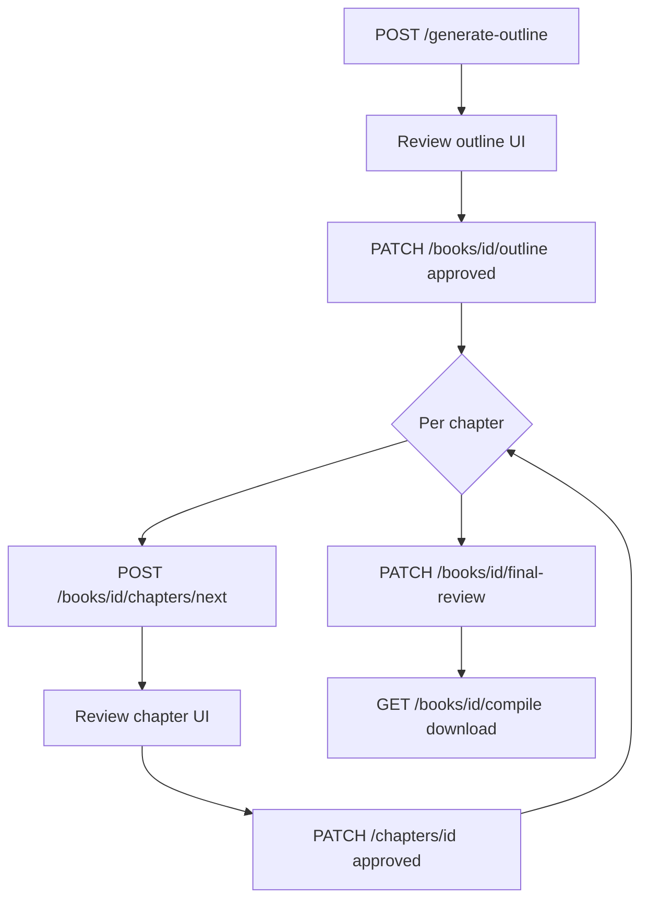

# Automated Book Generation System — API Documentation

API reference for building the frontend (e.g. Lovable). The backend is a **FastAPI** service with **human-in-the-loop** gates between AI generation steps.

---

## Base configuration

| Item | Value |
|------|--------|
| **Base URL (local)** | `http://localhost:8000` |
| **API prefix** | `/api/v1` |
| **OpenAPI / Swagger** | `GET /docs` |
| **Root** | `GET /` → `{ "docs": "/docs", "health": "/api/v1/health" }` |
| **Authentication** | None on the API (backend holds Supabase + OpenRouter keys) |
| **CORS** | `*` origins, all methods/headers allowed |
| **Content-Type** | `application/json` for request bodies |
| **IDs** | UUID strings (e.g. `"550e8400-e29b-41d4-a716-446655440000"`) |

Configure the frontend with an environment variable such as:

```env
VITE_API_BASE_URL=http://localhost:8000/api/v1
```

---

## Error responses

FastAPI returns errors as JSON:

```json
{ "detail": "Human-readable message" }
```

Validation errors (422):

```json
{
  "detail": [
    {
      "loc": ["body", "title"],
      "msg": "Field required",
      "type": "missing"
    }
  ]
}
```

| HTTP | When |
|------|------|
| **400** | Bad state (e.g. all chapters generated, no outline, no chapters for draft) |
| **403** | Compile blocked until final review cleared |
| **404** | Book or chapter not found |
| **409** | Gate not satisfied (outline not approved, chapter waiting for review) |
| **422** | Invalid request body |
| **502** | AI outline generation failed |

**Long-running requests:** `POST /generate-outline`, `POST /generate-chapter`, `POST /books`, `POST /books/{id}/chapters/next`, and `POST /chapters/{id}/regenerate` call the LLM and may take **30s–2min+**. Show loading states and consider timeouts ≥ 120s.

---

## Enums & domain model

### `StageStatus` (string)

Used on `books.outline_status`, `books.final_review_notes_status`, and `chapters.status`.

| Value | UI meaning |
|-------|------------|
| `pending_notes` | User should add notes before proceeding |
| `pending_review` | AI output ready; user must review |
| `outline_review` | Outline generated; awaiting outline review |
| `approved` | Human approved; safe to proceed / generate |
| `no_notes_needed` | Cleared without changes; proceed |

### `BookPhase` (string)

| Value | Meaning |
|-------|---------|
| `outline` | Working on outline |
| `chapters` | Writing chapters |
| `completed` | Book finished (set when final review cleared) |

### Outline shape (`outline` on book)

```json
{
  "chapters": [
    {
      "chapter_number": 1,
      "title": "Chapter title",
      "brief": "One-paragraph plan for this chapter"
    }
  ]
}
```

---

## Recommended user journey (primary flow)

Use this flow for a guided “create book” experience:



**Alternative chapter loop:** Pre-create chapter rows (see [Flow B](#flow-b--explicit-chapter-gating) below), then `POST /generate-chapter` per chapter.

---

## Endpoints

### Health

#### `GET /api/v1/health`

Check API, database, and LLM provider.

**Response 200**

```json
{
  "status": "ok",
  "message": "All services healthy",
  "supabase": { "status": "ok", "detail": null },
  "openrouter": { "status": "ok", "detail": null }
}
```

`status`: `"ok"` | `"degraded"` | `"error"`

Use on app load or a status/settings page.

---

### Generation

#### `POST /api/v1/generate-outline`

Generate an outline from title + notes and create a book row.

**Request body**

```json
{
  "title": "The Last Lighthouse",
  "notes": "Optional author notes, tone, genre, etc."
}
```

| Field | Type | Required | Constraints |
|-------|------|----------|-------------|
| `title` | string | yes | 1–500 chars |
| `notes` | string | no | |

**Response 200 — `BookResponse`**

Book is created with `outline_status: "outline_review"` and `phase: "outline"`. Save `id` as the active book.

---

#### `POST /api/v1/generate-chapter`

Generate prose + summary for an **existing** chapter row.

**Request body**

```json
{
  "chapter_id": "550e8400-e29b-41d4-a716-446655440000"
}
```

**Preconditions**

- Chapter `status` must be `approved` or `no_notes_needed`
- Returns **409** if `pending_review`, `pending_notes`, or `outline_review`
- Book must have an `outline` containing this chapter number

**Response 200 — `ChapterResponse`**

After generation, `status` becomes `pending_review` (if server `REQUIRE_HUMAN_REVIEW=true`) or `no_notes_needed`.

---

### Books

#### `POST /api/v1/books`

Alternative to `generate-outline`: create book, run outline AI, save in one call.

**Request body**

```json
{
  "title": "My Novel",
  "initial_notes": "Optional notes",
  "auto_approve_outline": false
}
```

| Field | Type | Default |
|-------|------|---------|
| `auto_approve_outline` | boolean | `false` |

**Response 200 — `BookResponse`**

`outline_status` depends on server config: `pending_review` if human review required, else `no_notes_needed`.

---

#### `GET /api/v1/books`

List all books, ordered by `created_at` descending (newest first).

**Response 200 — `BookResponse[]`**

Returns an empty array `[]` when no books exist.

---

#### `GET /api/v1/books/{book_id}`

Fetch a single book.

**Response 200 — `BookResponse`**

**404** if not found.

---

#### `PATCH /api/v1/books/{book_id}/outline`

Human review of the outline.

**Request body**

```json
{
  "human_notes": "Tighten chapter 3; add more foreshadowing in chapter 1.",
  "status": "approved"
}
```

| Field | Type | Default |
|-------|------|---------|
| `human_notes` | string | required |
| `status` | `StageStatus` | `"approved"` |

When `status` is `approved` or `no_notes_needed`, book `phase` moves to `"chapters"`.

**Response 200 — `BookResponse`**

---

#### `PATCH /api/v1/books/{book_id}/final-review`

Clear final review so compile is allowed.

**Request body**

```json
{
  "human_notes": "Ready to publish.",
  "status": "no_notes_needed"
}
```

| Field | Type | Default |
|-------|------|---------|
| `human_notes` | string | optional |
| `status` | `StageStatus` | `"no_notes_needed"` |

When `status` is `no_notes_needed`, `phase` becomes `"completed"` and `final_review_notes_status` updates.

**Response 200 — `BookResponse`**

---

#### `POST /api/v1/books/{book_id}/chapters/next`

Create the next chapter stub from the outline, generate content + summary, return chapter.

**Preconditions**

- Outline must be `approved` or `no_notes_needed` (**409** otherwise)
- **400** if every outline chapter already has a row

**Request body:** none

**Response 200 — `ChapterResponse`**

Initial `status`: `pending_review` or `no_notes_needed` per server config. Poll or PATCH after user review.

---

#### `GET /api/v1/books/{book_id}/chapters`

List chapters ordered by `chapter_number`.

**Response 200**

```json
[
  {
    "id": "...",
    "book_id": "...",
    "chapter_number": 1,
    "title": "...",
    "content": "...",
    "summary": "...",
    "status": "pending_review",
    "human_notes": null,
    "created_at": "2026-05-18T12:00:00Z",
    "updated_at": "2026-05-18T12:05:00Z"
  }
]
```

---

#### `GET /api/v1/books/{book_id}/draft`

Preview full manuscript as JSON (no download).

**Response 200 — `BookDraftResponse`**

```json
{
  "book": { /* BookResponse */ },
  "chapters": [ /* ChapterResponse[] */ ],
  "full_text": "# Title\n\n## Outline\n..."
}
```

**400** if no chapters exist yet. Use for in-app reader / preview pane.

---

#### `GET /api/v1/books/{book_id}/compile`

Download finished book as **plain text** file.

**Preconditions**

- `final_review_notes_status` must be `no_notes_needed` (**403** otherwise)
- At least one chapter (**400** if none)

**Response 200**

- `Content-Type: text/plain; charset=utf-8`
- `Content-Disposition: attachment; filename="{sanitized_title}_{book_id}.txt"`
- Body: UTF-8 text

In the browser, use `fetch` + `blob()` + temporary `<a download>` link.

---

### Chapters

#### `PATCH /api/v1/chapters/{chapter_id}`

Approve chapter or attach revision notes.

**Request body**

```json
{
  "human_notes": "Expand the opening scene.",
  "status": "approved"
}
```

| Field | Type | Default |
|-------|------|---------|
| `human_notes` | string | optional |
| `status` | `StageStatus` | `"approved"` |

**Response 200 — `ChapterResponse`**

---

#### `POST /api/v1/chapters/{chapter_id}/regenerate`

Regenerate chapter using `human_notes` and prior chapter summaries.

**Request body:** none

**Response 200 — `ChapterResponse`**

Sets `status` to `pending_review` after regeneration.

---

## Response schemas (TypeScript-friendly)

### `BookResponse`

```typescript
interface BookResponse {
  id: string;
  title: string;
  initial_notes: string | null;
  outline: {
    chapters: Array<{
      chapter_number: number;
      title: string;
      brief: string;
    }>;
  } | null;
  outline_status: StageStatus;
  final_review_notes_status: StageStatus;
  phase: "outline" | "chapters" | "completed";
  human_notes: string | null;
  created_at: string; // ISO 8601
  updated_at: string;
}
```

### `ChapterResponse`

```typescript
interface ChapterResponse {
  id: string;
  book_id: string;
  chapter_number: number;
  title: string;
  content: string | null;
  summary: string | null;
  status: StageStatus;
  human_notes: string | null;
  created_at: string;
  updated_at: string;
}
```

### `BookDraftResponse`

```typescript
interface BookDraftResponse {
  book: BookResponse;
  chapters: ChapterResponse[];
  full_text: string;
}
```

### `HealthResponse`

```typescript
interface HealthResponse {
  status: string;
  message: string;
  supabase: { status: string; detail: string | null };
  openrouter: { status: string; detail: string | null };
}
```

---

## Flow A — Sequential chapters (simplest for UI)

Best match for a linear wizard without manual DB steps.

| Step | Action | UI screen |
|------|--------|-----------|
| 1 | `POST /generate-outline` | New book form (title, notes) |
| 2 | `GET /books/{id}` | Outline review — render `outline.chapters` |
| 3 | `PATCH /books/{id}/outline` | Approve / request changes (notes textarea) |
| 4 | `POST /books/{id}/chapters/next` | “Generate next chapter” (repeat until 400) |
| 5 | `GET /books/{id}/chapters` | Chapter list with status badges |
| 6 | `PATCH /chapters/{id}` | Chapter review editor |
| 7 | `POST /chapters/{id}/regenerate` | Optional if user adds notes |
| 8 | `GET /books/{id}/draft` | Full preview |
| 9 | `PATCH /books/{id}/final-review` | Final sign-off |
| 10 | `GET /books/{id}/compile` | Download button |

**Progress hint:** Compare `chapters.length` to `outline.chapters.length` for a progress bar.

---

## Flow B — Explicit chapter gating

Use when outline approval and chapter generation are separate buttons per chapter.

1. `POST /generate-outline`
2. `PATCH /books/{id}/outline` with `"status": "approved"`
3. For each outline item, ensure a `chapters` row exists with `status: "approved"` **before** `POST /generate-chapter`
4. `POST /generate-chapter` with `{ "chapter_id": "..." }`
5. `PATCH /chapters/{id}` to approve
6. Final review + compile as in Flow A

> **Note:** The API has no “create empty chapter stub only” endpoint. Stubs are created automatically by `POST /books/{id}/chapters/next`. For Flow B, chapter rows must exist with `approved` status (today: database/admin or extend the backend). Prefer **Flow A** unless you add a stub-creation endpoint.

---

## UI screens checklist (for Lovable)

| Screen | Key API calls | Notes |
|--------|---------------|-------|
| **Dashboard / health** | `GET /health` | Show Supabase + OpenRouter status |
| **New book** | `POST /generate-outline` | Loading spinner; store returned `id` |
| **Outline review** | `GET /books/{id}`, `PATCH .../outline` | Card list from `outline.chapters`; notes + Approve |
| **Chapter workspace** | `GET /chapters`, `POST .../chapters/next` or `generate-chapter` | Side nav by chapter number |
| **Chapter editor** | `GET /chapters`, `PATCH /chapters/{id}`, `POST .../regenerate` | Show `content`, `summary`, `human_notes` |
| **Draft preview** | `GET /books/{id}/draft` | Render `full_text` or structured `chapters` |
| **Publish** | `PATCH .../final-review`, `GET .../compile` | Disable download until `final_review_notes_status === "no_notes_needed"` |

### Status → UI affordances

| Field | Value | Suggested UI |
|-------|-------|----------------|
| `outline_status` | `outline_review` | Show outline review panel |
| `outline_status` | `approved` / `no_notes_needed` | Enable “Generate chapters” |
| `chapters[].status` | `pending_review` | Show “Review” + notes form |
| `chapters[].status` | `approved` | Enable regenerate / next step |
| `final_review_notes_status` | not `no_notes_needed` | Hide or disable compile |
| `phase` | `completed` | Show success + download |

---

## Example requests (curl)

**Generate outline**

```bash
curl -X POST http://localhost:8000/api/v1/generate-outline \
  -H "Content-Type: application/json" \
  -d '{"title": "The Last Lighthouse", "notes": "Mystery on a remote island."}'
```

**Approve outline**

```bash
curl -X PATCH "http://localhost:8000/api/v1/books/{BOOK_ID}/outline" \
  -H "Content-Type: application/json" \
  -d '{"human_notes": "Looks good.", "status": "approved"}'
```

**Generate next chapter**

```bash
curl -X POST "http://localhost:8000/api/v1/books/{BOOK_ID}/chapters/next"
```

**Approve chapter**

```bash
curl -X PATCH "http://localhost:8000/api/v1/chapters/{CHAPTER_ID}" \
  -H "Content-Type: application/json" \
  -d '{"human_notes": "", "status": "approved"}'
```

**Final review + compile**

```bash
curl -X PATCH "http://localhost:8000/api/v1/books/{BOOK_ID}/final-review" \
  -H "Content-Type: application/json" \
  -d '{"status": "no_notes_needed", "human_notes": "Ready."}'

curl -O -J "http://localhost:8000/api/v1/books/{BOOK_ID}/compile"
```

---

## Frontend fetch examples

**JSON POST**

```typescript
const res = await fetch(`${API_BASE}/generate-outline`, {
  method: "POST",
  headers: { "Content-Type": "application/json" },
  body: JSON.stringify({ title, notes }),
});
if (!res.ok) {
  const err = await res.json();
  throw new Error(err.detail ?? res.statusText);
}
const book: BookResponse = await res.json();
```

**Download compile**

```typescript
const res = await fetch(`${API_BASE}/books/${bookId}/compile`);
if (!res.ok) throw new Error(await res.text());
const blob = await res.blob();
const url = URL.createObjectURL(blob);
const a = document.createElement("a");
a.href = url;
a.download =
  res.headers.get("Content-Disposition")?.match(/filename="(.+)"/)?.[1] ??
  "book.txt";
a.click();
URL.revokeObjectURL(url);
```

---

## Gate reference (backend rules)

| Action | Required state |
|--------|----------------|
| `POST .../chapters/next` | `outline_status` ∈ `approved`, `no_notes_needed` |
| `POST /generate-chapter` | Chapter `status` ∈ `approved`, `no_notes_needed` |
| `GET .../compile` | `final_review_notes_status` = `no_notes_needed` |
| `POST .../regenerate` | Chapter exists; uses `human_notes` |

---

## What the frontend does **not** need

- Supabase credentials (backend only)
- OpenRouter API key (backend only)
- Direct database access for normal operation

---

## Version

API version **1.0.0** (see `GET /docs` for live OpenAPI schema).
